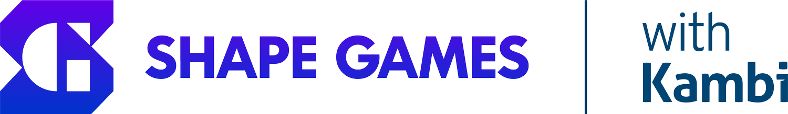

<div align="center">
 <div>
    
  </div>
  <h1>Zuzana's personal development project</h1>
</div>

This is a [Next.js](https://nextjs.org/) personal development project from Zuzana aimed for Shapes Games bootstrapped with [`create-next-app`](https://github.com/vercel/next.js/tree/canary/packages/create-next-app).

## Getting Started

First, run the development server:

```bash
npm run dev
# or
yarn dev
# or
pnpm dev
# or
bun dev
```

Open [http://localhost:3000](http://localhost:3000) with your browser to see the result.

This project uses [`next/font`](https://nextjs.org/docs/basic-features/font-optimization) to automatically optimize and load Inter, a custom Google Font.

## About the project

This project servers as a learning curve to explore Next.js 14 features and to showcase different topics that have been covered as a part of personal development.

## Disclaimer

PostgresSQL db was set up only locally, therefore all the content will be only visible upon presentation in person.
There is no script to seed the db.
